# Authentication, Session, and Tenant-Isolation Architecture

| Field | Value |
| --- | --- |
| ADR | ADR-001 / SEC-DEC-002 |
| Status | **Accepted for local implementation — D1–D6 approved** |
| Date | 2026-08-01 |
| Last updated | 2026-08-03 |
| Evidence baseline | Git commit `88ec6954ef2f781a0038509e2a6ae4cdc5549ee0` |
| Scope | Phase A architecture plus Phase B tenant/infrastructure foundation status; no production authentication |
| Owners | Product/account behavior and risk acceptance: Project owner; security findings and incident response: Security owner; Keycloak administration/upgrades: Identity operator; deployment/local TLS: Deployment operator; backup/restore: Database operator |

## Decision gate

This ADR must be accepted before production authentication, account, session, recovery, or tenant
migration code is written. It deliberately does not treat the historical SRS or Swagger's OAuth
redirect route as proof of an implemented or approved identity system.

The following product and operating decisions cannot be inferred from the repository. D1–D5 and
the physical-phone TLS demo path were approved by the project owner on 2026-08-03. The project
owner subsequently approved role-based, rather than named-person, D6 assignments:

| ID | Required decision | Status and decision/default | Why approval is required |
| --- | --- | --- | --- |
| D1 | Intended API exposure and TLS termination | **Approved:** local/demo-only for the current phase. Keep the trusted-local classification. Any future shared/external exposure requires a new review with a named, verified HTTPS termination point before traffic is enabled. | The repository has an ingress but no TLS host; external infrastructure is unknown. |
| D2 | OIDC deployment or first-party email/password | **Amended and approved:** standards-based OIDC with a self-hosted Keycloak provider for the local demo. This replaces the commercial managed-provider direction because the demo must have no identity-service charge. A commercial managed provider is deferred to a future external-deployment review. | This choice changes tables, endpoints, mobile flows, recovery, and incident duties. |
| D3 | Verification and recovery policy | **Approved:** Keycloak verification is required before usable credentials and LockdIn account enablement. Verification/reset mail goes only to local Mailpit using synthetic addresses. Verification and forgot-password actions expire after 15 minutes. Responses are generic, reset forces reauthentication, and successful reset triggers logout-all. | Captured local email is test evidence rather than real delivery; provider action semantics must be verified against the pinned version. |
| D4 | Session architecture and lifetime | **Approved:** accept Keycloak access tokens directly; do not issue a second LockdIn bearer credential. Use per-request introspection plus a minimal LockdIn revocation registry. The exact client, claim, lifetime, logout, and physical-phone TLS contract is below. | This gives next-request local revocation without implementing a second credential family, at the cost of a Keycloak availability dependency. |
| D5 | Existing default-profile and pre-login device data | **Approved:** keep the default profile demo-only and unclaimed. Quarantine pre-login queues until explicit Import or Discard. Other-account rows remain quarantined until that account returns or the user explicitly deletes them. | Automatically assigning sensitive history to a registrant is unsafe. |
| D6 | Operational owners | **Approved as role-based assignments:** Project owner owns product/account behavior and risk acceptance; Security owner owns security findings and incident response; Identity operator owns Keycloak administration/upgrades; Deployment operator owns deployment/local TLS; Database operator owns backup/restore. One person may hold multiple roles, but the acting people must be identified in the private project runbook before an actual release or incident exercise. | The repository cannot name people, but it can assign accountable roles approved by the project owner. |

The current application remains a trusted local/demo deployment under D1. D1–D6 complete the Phase
A decision gate for local implementation. Role names do not prove operational readiness: the
acting people, contacts, access, and runbooks still require verification before an actual release,
incident exercise, or any shared/external exposure. Authentication remains unimplemented until
working controls and evidence exist.

## Phase B implementation status

Phase B implements the guarded Alembic migration head, explicit demo/active profile state,
account/external-identity ownership, minimal account not-before and revoked provider-session
storage, the typed `CurrentPrincipal`, protected route boundaries, operator-scoped aggregate
rebuild, and profile-scoped services. The default principal and operator dependencies fail closed;
tests override them only with synthetic trusted principals.

The pinned local Keycloak, separate Keycloak PostgreSQL volume, Mailpit, and Caddy TLS foundation
are configured but were not started or physically trusted as part of this change. Phase B does not
implement Keycloak realm/client configuration, introspection, account bootstrap, token/session
validation, or Flutter login. Those remain Phase C/D work, so “authentication implemented” and
production-readiness claims remain prohibited.

## Context and evidence

The FastAPI application is a modular monolith mounted under `/api/v1`. Phase B route functions
depend on a fail-closed typed principal and a database session, then call profile-scoped services
and repositories. Real token authentication is not installed. Application startup no longer
creates a profile, and protected services no longer call `ensure_default_profile()`.

The current database is closer to tenant-ready than the request layer: every behavioral table has
a non-null `profile_id` foreign key, and most repository reads include `profile_id`. The missing
control is a trusted current principal that selects the authorized profile. Consequently, every
caller currently reaches the same profile.

The Android client has no authentication state or guarded route. Dio sends no credential. The
native uploader posts directly to `/api/v1/usage/events` without using Dio, and its SQLite queue
does not record an account/profile owner. Flutter and native SharedPreferences contain usage
watermarks, cached rule/enforcement state, pending enforcement events, and the native uploader base
URL. No secure credential-storage dependency is present.

Historical documents describe email/password, optional Google OAuth, JWT or session-token ideas,
and anonymous device-only mode. Those are requirements/design hypotheses, not current contracts.

## Current endpoint exposure inventory

The “current behavior” column below records the Phase A baseline. Phase B now applies a
fail-closed principal boundary to every protected target and a separate operator boundary to
aggregate rebuild; real authentication remains Phase C.

| Method and path | Current behavior / data | Current profile resolution | Target exposure |
| --- | --- | --- | --- |
| `GET /` | Service-running message | None | Public liveness only if operationally required; otherwise omit at the edge. |
| `GET /api/v1/health` | Liveness name/version | None | Public liveness; do not add sensitive readiness detail. |
| `GET /api/docs` | Swagger UI | None | Development only or explicitly operator-restricted in production. |
| `GET /api/redoc` | ReDoc UI | None | Development only or explicitly operator-restricted in production. |
| `GET /openapi.json` | Live API schema | None | Development only or explicitly operator-restricted in production. |
| `GET /docs` and `/docs/` | Static backend guide redirect/content | None | Development/operator documentation; not automatically public. |
| `GET /api/v1/accountability/contacts` | Lists contact names/emails/consent | `ensure_default_profile()` | Authenticated profile owner. |
| `POST /api/v1/accountability/contacts` | Creates a contact | `ensure_default_profile()` | Authenticated profile owner; future contact-verification policy applies. |
| `DELETE /api/v1/accountability/contacts/{contact_id}` | Deletes a contact | `ensure_default_profile()` | Authenticated profile owner; non-enumerating cross-tenant result. |
| `GET /api/v1/analytics/dashboard` | Usage totals/categories | `ensure_default_profile()` | Authenticated profile owner. |
| `GET /api/v1/analytics/trends` | Hourly/weekly/top-app usage | `ensure_default_profile()` | Authenticated profile owner. |
| `GET /api/v1/analytics/weekly-summary` | Week totals/goals/streak | `ensure_default_profile()` | Authenticated profile owner. |
| `POST /api/v1/enforcement/events` | Creates warning/intervention evidence | `ensure_default_profile()` | Authenticated profile owner/device; referenced rule must share profile. |
| `GET /api/v1/me/preferences` | Reads onboarding/display/limit preferences | `ensure_default_profile()` | Authenticated profile owner. |
| `PUT /api/v1/me/preferences` | Updates preferences | `ensure_default_profile()` | Authenticated profile owner. |
| `GET /api/v1/rules` | Lists rules | `ensure_default_profile()` | Authenticated profile owner. |
| `GET /api/v1/rules/status` | Rules plus current usage/status | `ensure_default_profile()` | Authenticated profile owner. |
| `POST /api/v1/rules` | Creates a rule | `ensure_default_profile()` | Authenticated profile owner. |
| `PATCH /api/v1/rules/{rule_id}` | Updates a rule | `ensure_default_profile()` | Authenticated profile owner; non-enumerating cross-tenant result. |
| `DELETE /api/v1/rules/{rule_id}` | Deletes a rule | `ensure_default_profile()` | Authenticated profile owner; non-enumerating cross-tenant result. |
| `POST /api/v1/usage/events` | Ingests raw app usage | `ensure_default_profile()` | Authenticated profile owner/device; queue owner must match principal. |
| `POST /api/v1/usage/aggregates/rebuild` | Rewrites derived aggregates | `ensure_default_profile()` | Internal/operator-only by default, or remove from public routing. |

The selected design keeps signup, verification, recovery, and the authorization callback in the
Keycloak-hosted OIDC flow unless a later reviewed backend contract requires a route. Any bootstrap
route remains public only where the approved design requires it. “Public” never means unthrottled
or allowed to disclose account existence.

## Persistent and device data ownership inventory

### PostgreSQL

| Store | Sensitive or identifying fields | Current owner | Required owner/invariant |
| --- | --- | --- | --- |
| `profiles` | Stable UUID, slug, display name | The single default profile | Tenant boundary for behavioral data; exactly one owning account in the initial product model, except an explicitly marked demo profile. |
| `preferences` | Onboarding state, limits, tone, accessibility choices | `profile_id` | One row per authorized profile. |
| `rules` | App package/name, limit, enabled state | `profile_id` | Profile-scoped unique `(profile_id, app_id)`; all ID lookup/update/delete queries include profile. |
| `accountability_contacts` | Contact name, email, consent flag | `profile_id` | Profile-scoped; consent flag is not proof that the contact personally verified consent. |
| `usage_events` | App/package, name/category, source ID, exact timestamps, time zone | `profile_id` | Profile-scoped unique `(profile_id, source_event_id)`; upload principal supplies owner server-side. |
| `usage_daily_app_aggregates` | Date, app, total minutes | `profile_id` | Derived only from raw events belonging to the same profile. |
| `usage_daily_category_aggregates` | Date, category, total minutes | `profile_id` | Derived only from raw events belonging to the same profile. |
| `enforcement_events` | App, rule, date, usage/limit, metadata | `profile_id`; optional `rule_id` | Profile-scoped; referenced rule, if present, must belong to the same profile. |

No current table stores an account, identity provider subject, password hash, session, verification
action, recovery action, audit event, device registration, or role. No admin role is introduced by
this ADR because no product requirement justifies one.

No current backend request schema or PostgreSQL table stores a separate device identifier. Future
session device labels may help a user recognize sessions, but a hardware identifier must not become
an authentication factor or a client-controlled ownership boundary.

### Android/Flutter device state

| Store | Current data | Current ownership gap | Required lifecycle |
| --- | --- | --- | --- |
| Native SQLite `lockdin_usage_queue.db` | Raw queued usage slices, timestamps, time zone, retry metadata | No account or install-generation owner | Add immutable local owner state (`unclaimed` or account subject/generation); uploader sends only matching rows. |
| Flutter SharedPreferences | Successful-sync timestamp and usage watermark | Global to app install | Namespace by local account generation and never advance one account from another account's upload. |
| Native `lockdin_enforcement` SharedPreferences | Cached rule status, local usage, uploaded intervals, warnings, pending intervention/events, tone | Global to app install | Namespace or clear transactionally on account change; stop background upload before transition. |
| Flutter SharedPreferences warning dedupe | Emitted-warning markers | Global to app install | Namespace by account generation. |
| Native uploader SharedPreferences | Base URL | Not secret and not an owner | May remain install-scoped configuration; never store credentials here. |
| Future credential storage | Not present | No approved store | Use platform-backed secure storage for session/refresh material; ordinary SharedPreferences is prohibited for long-lived secrets. |

App/package identity and exact usage timestamps can reveal sensitive behavior. They are confidential
behavioral data even when no email is stored beside them.

## Trust boundaries and data flow

```mermaid
flowchart LR
    User["Person using LockdIn"] -->|sign-in / explicit import choice| Flutter["Flutter UI and auth state"]
    Android["Android UsageStats and Accessibility"] -->|raw usage slices| Queue["Owner-tagged private queue"]
    Queue -->|only when queue owner matches active principal| Uploader["Dio or native authenticated uploader"]
    Flutter -->|credential via secure storage| Uploader
    Uploader -->|HTTPS; authenticated request| Edge["TLS termination / API edge"]
    Edge --> FastAPI["FastAPI public and protected routes"]
    IdP["Local self-hosted Keycloak OIDC provider"] <-->|Authorization Code + PKCE| Flutter
    IdP -->|validated issuer/audience/keys| FastAPI
    FastAPI --> Principal["Current-principal dependency"]
    Principal -->|server-derived profile_id| Services["Profile-scoped services"]
    Services --> Repositories["Profile-scoped repositories"]
    Repositories --> PostgreSQL["PostgreSQL account/session/profile data"]
    Ops["Named operator"] -->|separate privileged path| Internal["Aggregate rebuild / operational routes"]
    Internal --> Services
```

Trust boundaries exist at the person/device, OS data collectors, local persistent storage,
client-to-edge network, identity provider (if selected), API authentication dependency,
service/repository authorization boundary, database, and operator path. CORS is outside the
authentication boundary.

## Threat and abuse cases

| ID | Scenario | Required design response |
| --- | --- | --- |
| TM-01 | An unauthenticated caller reads or changes behavioral data. | Deny every non-public route before service execution (AUTH-01). |
| TM-02 | A valid user guesses another user's rule/contact ID. | Derive profile server-side and include it in repository predicates; return the same missing-resource contract (AUTH-03/04). |
| TM-03 | A token/session is stolen from a device or log. | Platform-backed storage, no secret logging, bounded lifetime, rotation, server-side revocation, logout-all, audit events. |
| TM-04 | A rotated credential is replayed. | Atomic rotation; revoke the credential family/session on replay according to the approved session model. |
| TM-05 | Login or recovery reveals whether an email exists. | Generic response body/status/timing envelope where feasible; per-IP and per-account-key throttling; audit without raw credentials. |
| TM-06 | Password reset leaves compromised sessions active. | Revoke all sessions for the account on successful reset by default; notify the account through an approved channel. |
| TM-07 | A user changes accounts while native uploads continue. | Serialize account transition, stop drain, atomically switch generation, and upload only owner-matching rows. |
| TM-08 | Pre-login or old-account data uploads under a new account. | Keep unclaimed/other-owner rows quarantined; explicit import/discard; backend never accepts client-supplied profile ID. |
| TM-09 | The seeded default profile is claimed by the first registrant. | Mark/retain it as demo-only and never link it automatically to an account. |
| TM-10 | A malicious client supplies another `profile_id` or device ID. | Do not accept ownership IDs for ordinary resource operations; device identifiers are metadata, not authorization. |
| TM-11 | Aggregate rebuild is abused for resource exhaustion or evidence rewriting. | Remove from public user surface or require separate operator authorization and rate/concurrency control. |
| TM-12 | Verification/reset links are leaked or stored in plaintext. | Keep Keycloak-managed signed action links single-use and short-lived; do not store them in LockdIn; redact logs and evidence; test invalidation and reuse behavior against the pinned provider version. |
| TM-13 | Unicode/case email aliases produce duplicate or confused accounts. | Use an approved canonicalization policy; preserve display address separately; rely on verified provider subject where OIDC is selected. |
| TM-14 | Accountability data is used for stalking, coercion, or phishing. | Separate contact ownership from verified contact consent; minimize messages and support revocation/blocking before delivery is built. |
| TM-15 | TLS or issuer/audience configuration is wrong. | Fail closed; verify the real termination path and credential issuer/audience in staging (AUTH-02, NET-01–04). |
| TM-16 | A backup/rollback restores old session validity. | Keep session/credential revocation state inside the consistency and restore plan; rotate secrets after security-sensitive restore. |

## Account/profile model alternatives

### Recommended foundation: account owns one profile

Keep `Profile` as the tenant/behavioral-data boundary and introduce a separate LockdIn
account/external-identity entity linked one-to-one to a non-demo profile. Keycloak owns credentials;
LockdIn links the immutable provider issuer and subject to its account and profile.

Benefits:

- preserves existing `profile_id` foreign keys and repository query shapes;
- keeps credential lifecycle separate from behavioral preferences and usage history;
- supports a demo profile that is intentionally not claimable;
- leaves room for a future account-to-multiple-profiles feature without making that promise now.

Initial invariants:

1. One enabled account owns exactly one non-demo profile.
2. One non-demo profile has at most one owning account.
3. The default profile is explicitly demo/unclaimed and cannot authenticate.
4. The principal contains stable account ID and server-derived profile ID.
5. There is only a normal account role initially. Operator access is a deployment concern, not an
   invented end-user admin role.

### Rejected alternative: put credentials directly on `profiles`

This minimizes tables but mixes authentication with behavioral tenancy, makes managed identities
awkward, and creates pressure to convert the default demo row into a real account. It is rejected.

### Rejected alternative: replace every `profile_id` with `account_id`

This creates a wide, high-risk migration with no product benefit for the initial one-account/
one-profile model. It is rejected.

### Deferred alternative: accounts with multiple profiles or shared households

There is no current requirement for household sharing, child profiles, teams, or delegated access.
It would require membership/role tables and a different authorization matrix. It is deferred.

## Identity architecture comparison and decision (D2)

| Dimension | Self-hosted Keycloak OIDC — selected for demo | Commercial managed OIDC — future option | LockdIn first-party email/password — rejected |
| --- | --- | --- | --- |
| Credential handling | Keycloak implements password hashing, verification actions, recovery, sessions, and OIDC endpoints; the project operates Keycloak. | Vendor implements and operates those controls. | LockdIn application code implements and operates the full credential lifecycle. |
| Protocol/client | Authorization Code with PKCE in the mobile app; backend validates the configured Keycloak issuer/audience and claims. | Same standards flow against the selected vendor. | LockdIn-defined signup/login/recovery API and session issuance. |
| Revocation | Keycloak supplies session/logout/revocation capabilities; LockdIn must integrate account/profile status and any application session. | Provider capabilities and plan limits apply. | LockdIn must design, implement, and test every revocation path. |
| Availability/demo | Runs on the existing local Docker host without a cloud identity dependency. | Requires internet and a maintained vendor tenant. | Runs locally, but LockdIn must build the sensitive identity machinery. |
| Monetary cost | No software-license or identity-service charge when run on existing local hardware; local compute, maintenance time, and future hosting are not zero-cost resources. | A free tier may work but price, quotas, and features can change. | No vendor fee, but substantially higher engineering and security-operating cost. |
| Email for demo | Local Mailpit captures synthetic verification/reset messages without external delivery charges. | Vendor/email-plan limits apply. | LockdIn must integrate and secure email delivery or a test SMTP system itself. |
| Data/privacy | Identity data remains in the local demo environment. | Login metadata is shared with the vendor under its terms/configuration. | Credential data remains local but increases the impact of LockdIn defects or compromise. |
| Security error surface | Standards/configuration risk remains, but LockdIn does not implement password cryptography. The team must patch and configure Keycloak. | Lower infrastructure burden; issuer/audience/redirect/account-linking mistakes remain. | Largest custom surface: hashing, enumeration, throttling, reset, rotation, email, and auditability. |
| Best fit | Current local, zero-service-charge academic demonstration. | A future shared/external service after cost and deployment approval. | Only if owning identity itself becomes a firm product requirement. |

**Amended decision:** use standards-based OIDC with a self-hosted Keycloak provider for the local
demo. The earlier commercial managed-OIDC direction was superseded when the project owner required
the authentication route to incur no service charge. A managed provider remains an option for a
future externally reachable deployment, but it is not part of the current demo plan.

In plain language, “fully self-contained first-party email/password accounts” would mean LockdIn
itself provides the signup and login forms, stores password hashes in its own PostgreSQL database,
sends verification and password-reset email, creates and revokes sessions, prevents login/recovery
abuse, and responds to credential incidents. It does **not** mean storing plaintext passwords, but
it does make this project responsible for the entire credential lifecycle. That alternative was
not selected.

[Keycloak](https://github.com/keycloak/keycloak) is open-source software under the Apache License
2.0, provides [official container guidance](https://www.keycloak.org/getting-started/getting-started-docker),
and documents its [OIDC endpoints and revocation support](https://www.keycloak.org/securing-apps/oidc-layers).
The exact Keycloak and [Mailpit](https://github.com/axllent/mailpit) image versions/digests, realm
export, configuration, database isolation, and upgrade procedure must be pinned and reviewed in the
Phase B change. A separate Keycloak database/volume must not destroy or repurpose the existing
LockdIn database volume. Mailpit is demo/test infrastructure: it captures synthetic mail locally
and does not prove real email delivery.

### Zero-charge demo boundary

“Completely free of charge” means no paid identity subscription, SMTP relay, SMS, custom domain,
public hosting, or certificate service is required for the local demo. It does not mean that CPU,
memory, network access, maintenance effort, or future cloud hosting has no cost.

Only synthetic demo accounts and addresses may be used. Development HTTP may be used only on an
explicitly trusted loopback boundary where no bearer credential crosses a physical network.

The approved demonstration target is the physical Android phone over the trusted local network.
The canonical demo origin is `https://192.168.2.44` on the standard HTTPS port, with the Keycloak
issuer `https://192.168.2.44/realms/lockdin`. A zero-license-cost local TLS reverse proxy must route
the Keycloak and API paths without changing that external issuer. Its leaf certificate must contain
the exact IP address in the Subject Alternative Name and chain to a dedicated local demo CA. The CA
private key, leaf private key, and generated secret material stay outside Git.

Android apps targeting current API levels do not trust the user-added CA store by default. The
demo/debug build must therefore use Android Network Security Configuration to keep cleartext
disabled and trust the user-installed demo CA only in a debug-only override. The project owner
manually installs/removes the CA on the phone and performs all browser/trust interactions. The
repository must not automate phone control. The system-browser OIDC flow and Flutter/API client
must both pass hostname/IP, chain, validity, and cleartext-downgrade tests on the actual phone.
This is local-demo trust evidence, not a publicly trusted production certificate. A release build
or external deployment requires a separately approved trust design and production security gate.

See Android's
[Network Security Configuration](https://developer.android.com/privacy-and-security/security-config)
guidance for custom trust anchors and debug-only overrides.

The implementation must follow the standards baseline rather than an embedded password web view:

- [RFC 8252](https://www.rfc-editor.org/rfc/rfc8252.html) requires native apps to use an external
  user-agent and PKCE;
- [RFC 9700](https://www.rfc-editor.org/rfc/rfc9700.html) records current OAuth 2.0 security best
  practices, including PKCE protections;
- [OpenID Connect Core 1.0](https://openid.net/specs/openid-connect-core-1_0-final.html) defines the
  issuer, subject, audience, and ID-token validation model. LockdIn identity linking uses immutable
  issuer plus subject, not an unverified email address.

## Approved session lifecycle (D4)

### Common guarantees

The following guarantees apply to the selected Keycloak design:

- credentials are bearer secrets and travel only over the verified HTTPS path above;
- server checks issuer/audience where applicable, expiry, account status, session status, and
  server-derived profile ownership;
- secrets never appear in URLs, logs, exception detail, analytics, screenshots, fixtures, or
  notification text;
- logout records the current provider session as revoked and clears matching local
  credential/cache state;
- logout-all revokes every session for the account;
- a successful Keycloak password reset or confirmed account compromise revokes every session;
- rotation is atomic and replay of an already-rotated credential revokes the affected session
  family;
- multiple devices use separate named/auditable session rows; no stable hardware identifier is an
  authentication factor;
- disabling/deleting an account prevents renewal and protected API access immediately;
- approved idle and absolute lifetimes are configurable per environment but may not be silently
  lengthened.

### Non-selected first-party session design

Issue a high-entropy random bearer credential, store only its cryptographic hash in PostgreSQL,
and associate it with a session row containing account, issued/last-used/expiry/revoked timestamps,
credential generation, and minimal device label/metadata. Rotate the credential during renewal and
use a compare-and-swap transaction so two refreshes cannot both succeed.

Opaque sessions are preferred over self-contained JWTs here because revocation, logout-all,
password-reset invalidation, replay detection, and incident inspection are explicit requirements
and the modular monolith already depends on PostgreSQL. This avoids claiming statelessness while
adding a revocation database anyway.

### Selected direct-token design

The Flutter app uses Keycloak's native Authorization Code flow through the system browser. The
public client is `lockdin-mobile`, uses the exact private-use redirect URI
`com.lockdin.lockdin_app:/oauth2redirect`, and requires transaction-specific PKCE with `S256`.
Implicit, hybrid, direct-access/password, device-authorization, client-credentials, and offline
access grants are disabled for this client. No client secret is present in the app or APK.

The API accepts Keycloak access tokens directly and does not mint a second LockdIn bearer token.
The backend uses a separate confidential client named `lockdin-api`; its credential remains a
server-only secret. Keycloak access tokens must contain `lockdin-api` as the exact audience and
`lockdin-mobile` as the authorized party/client. The backend accepts only the exact issuer
`https://192.168.2.44/realms/lockdin`, RS256, required `sub`, `sid`, `iat`, and `exp` claims,
validates `nbf` when present, and requires `email_verified` to be `true`. Identity linking uses
exact `(issuer, subject)`.

Every protected request is checked through Keycloak token introspection by `lockdin-api`, without
positive-result caching. Current Keycloak versions require the introspecting confidential client
to be present in the token audience. The backend then checks the LockdIn account is enabled, the
token issue time is not before the account revocation boundary, the `sid` is not revoked, and the
server-derived profile is active. If Keycloak is unavailable or a response is ambiguous, protected
requests fail closed before service execution. The Phase C implementation must use bounded
timeouts/concurrency and expose no introspection secret or token in logs.

The minimal LockdIn revocation registry stores provider session identifiers and account-level
not-before timestamps; it does not store raw Keycloak credentials. Current-device logout revokes
the current `sid`, invokes the supported Keycloak logout path, stops uploads, and clears local
state. Logout-all, successful password reset, account disablement, and confirmed compromise advance
the account not-before boundary and terminate all Keycloak sessions. A narrowly scoped, automated
Keycloak-to-LockdIn event/admin integration must implement reset/logout-all invalidation; the
default reset flow must not be assumed to revoke other devices. Back-channel event signatures,
replay, delivery failure, and reconciliation require tests against the pinned Keycloak version.

### Approved lifetimes, rotation, and device behavior

- access-token lifetime: 5 minutes;
- client-session idle lifetime: 30 minutes;
- absolute client-session lifetime: 8 hours;
- maximum concurrent client sessions per account: 3, terminating the oldest;
- Keycloak refresh-token revocation/rotation: enabled, with single-use behavior and no reuse
  allowance;
- offline tokens and Remember Me: disabled;
- refresh-token replay: revoke the active provider grant/session and require fresh authorization;
- concurrent client renewal: one single-flight operation, with waiting requests retried at most
  once;
- renewal failure or ambiguous token state: stop uploads and enter `reauthenticationRequired`;
- local access/refresh material: platform-backed secure storage only, never SharedPreferences;
- each physical device/browser authorization has a distinct `sid`; a hardware identifier is not an
  authentication factor.

Keycloak documents that signing out sessions does not by itself revoke already-issued access
tokens in every integration. The local `sid`/not-before checks are therefore mandatory rather than
an optimization. Phase C tests must prove missing, malformed, expired, explicitly revoked,
wrong-issuer, wrong-audience, wrong-algorithm, reused-refresh, disabled-account, and reset-invalidated
credentials fail as specified.

## Approved verification, recovery, and enumeration policy (D3)

- Keycloak realm email verification is enabled. Keycloak must complete verification before issuing
  usable mobile credentials; LockdIn does not enable/create the owned account/profile from an
  unverified principal.
- Verification and forgot-password action lifetimes are each 15 minutes. Resend throttling and
  action expiry/reuse behavior must be asserted against the pinned provider version.
- Keycloak sends verification/reset email only to local Mailpit. Only synthetic demo addresses may
  be used, and Mailpit must not relay externally.
- Keycloak-hosted signup, verification, resend, login, and recovery flows use generic responses
  wherever account existence could otherwise be disclosed. Status, body, timing envelope, and
  throttling require acceptance tests; themes must not reintroduce enumeration.
- Provider action links are Keycloak-managed signed bearer action tokens, not LockdIn tokens and
  not LockdIn database hashes. They are never committed, logged, screenshotted, or stored as
  durable Flutter preferences.
- The reset flow sets `Force login after reset` to `true`. Successful reset invokes the D4
  logout-all/not-before behavior, and the user signs in again.
- Password changes from an authenticated session revoke other sessions by default and rotate the
  current session according to the tested provider flow.
- Audit events record action type, outcome category, account/session IDs where known, coarse source
  metadata, and timestamp; they exclude email where a stable internal ID is available and exclude
  all secrets.

## Tenant-isolation enforcement design

1. Add a `CurrentPrincipal` request dependency that authenticates the request and resolves
   `account_id`, `profile_id`, session/account status, and verification state server-side.
2. Apply it at a protected router boundary so omission requires an explicit public-route review.
3. Pass `profile_id` (or the typed principal) into every service method. Remove runtime calls to
   `ensure_default_profile()` from protected flows.
4. Keep `profile_id` in every repository predicate for list, get, update, delete, analytics,
   overlap, idempotency, enforcement, and rebuild operations.
5. Never add profile/account ownership fields to ordinary client request schemas. When an object ID
   is supplied, query by both object ID and authorized profile.
6. Use a uniform missing-resource result for nonexistent and other-tenant identifiers. Do not
   reveal which condition occurred in response text or timing intentionally.
7. Validate cross-table ownership: an enforcement event's `rule_id`, aggregate source events, and
   any future contact/notification record must share the principal profile.
8. Protect aggregate rebuild behind an internal/operator mechanism separate from normal user
   sessions. If no operational need is approved, do not expose it through the public edge.
9. Retain database foreign keys/unique constraints and add account/profile uniqueness constraints.
   PostgreSQL row-level security may be evaluated as defense in depth after request and repository
   isolation work; it is not a substitute for correct application authorization.
10. Test every protected route with no credentials and with two synthetic accounts. Service and
    repository tests must prove that bypassing Flutter cannot cross the tenant boundary.

## Default-profile and migration strategy

No database changes occur in this ADR phase. Editing `database/initdb/10-schema.sql` alone is not a
migration for an existing volume.

### Versioned mechanism

Phase B adopts pinned Alembic 1.18.5. Revision `20260803_01` records applied state, runs through a
one-shot Compose migration service, creates an empty schema, and accepts an unversioned database
only after verifying its exact legacy shape. The isolated PostgreSQL harness now passes empty and
legacy upgrades, ownership triggers, and two-account request isolation. The actual bootstrap SQL
and an isolated custom-format dump/restore round trip also pass on PostgreSQL 16.13.

### Additive sequence

The exact DDL depends on the pinned provider's claim/session behavior and the still-unselected
account/revocation schema details. It must be reviewed before execution. The required order is:

1. Inventory and back up the target database; record counts and referential-integrity checks for
   every current table without printing sensitive row contents.
2. Add an explicit demo/non-claimable marker to `profiles` or equivalent migration metadata.
3. Mark the `default` profile and fixed seed ID as demo/non-claimable. Do not attach it to any
   account.
4. Add account/external-identity tables and a nullable ownership link with uniqueness constraints,
   including unique `(issuer, subject)`. Do not add LockdIn password-credential metadata and do not
   store raw provider access or refresh tokens.
5. Add only the minimal provider-session revocation, account not-before, and security-audit data
   required by D4. Verification/recovery action tokens remain Keycloak-owned.
6. Deploy code that understands both the legacy demo profile and new owned profiles while keeping
   the API in trusted/local or maintenance mode.
7. Create new account and profile rows transactionally. Never backfill the default profile into a
   new account.
8. Refactor services away from `ensure_default_profile()`, protect routes, and run two-user
   PostgreSQL isolation tests.
9. Only after successful verification, make ownership constraints non-null where applicable and
   enable shared/external exposure.
10. Update `10-schema.sql`, ORM models, the seed, and migration head together so fresh databases and
    upgraded databases converge on the same schema.

### Compatibility, rollback, and recovery

- Before the point of no return, rollback means deploy the prior application and leave additive,
  unused tables/columns in place; do not drop them during an incident.
- Keep the default profile and all current behavioral rows unchanged throughout rollout.
- Do not rebuild aggregates as part of authentication migration.
- Do not delete, reassign, or rewrite usage/enforcement history.
- If a migration fails, stop application rollout, restore the pre-migration application, preserve
  the failed database for diagnosis, and restore from the tested backup only when forward repair is
  unsafe.
- A restore test must prove profiles, preferences, rules, contacts, raw usage, both aggregate
  tables, and enforcement events remain intact.
- Session/verification/recovery secrets created after a backup require an explicit invalidation
  strategy after restore; security-sensitive recovery should revoke all sessions and rotate
  affected keys.
- Destructive down-migrations are not the primary rollback plan. A later reviewed cleanup migration
  may remove unused structures only after the compatibility window and backup retention period.

The Phase B change includes the exact additive schema diff and fail-closed legacy-shape checks.
The trigger paths serialize ownership checks on the profile row, and disposable migration,
bootstrap, row-preservation, and dump/restore evidence now exists. Target-deployment inventory,
lock observation under representative load, the full forward/backward compatibility matrix, and
the operational rollback decision point remain release evidence requirements.

## Flutter credential, cache, and queue lifecycle

### Bootstrap states

Routing must model these states separately:

1. `initializing`: secure-store and account/session bootstrap incomplete;
2. `signedOut`: authentication routes only; local unclaimed-data choice may be shown;
3. `verificationRequired`: only verification/resend/logout routes;
4. `authenticated`: protected product routes;
5. `reauthenticationRequired`: credential invalid/revoked; uploads stopped;
6. `accountTransition`: queue drain stopped while state is cleared/re-scoped.

Onboarding completion is a preference inside an authenticated profile. It is not proof of
authentication and must not drive the auth guard.

### Queue ownership

- Generate a random local account-generation ID for each signed-in account binding. Persist a
  stable server account subject alongside it in platform-backed storage where appropriate.
- Every usage and pending enforcement queue row records its owner generation at creation time.
- Rows collected while signed out are `unclaimed`; they are never uploaded automatically.
- On first sign-in, present an explicit, plain-language import-or-discard choice for unclaimed rows.
  Import atomically relabels only those rows to the active account generation and records consent.
- On account switch, uploader and collectors stop, in-flight requests finish or are cancelled, and
  only rows matching the new active generation can drain.
- Rows for a different account stay quarantined until that account returns or the user explicitly
  deletes them. Product must approve a bounded retention policy.
- Source-event idempotency remains per server profile. Client source IDs must remain stable during
  retry and must not be rewritten merely because the account changes.

### Logout and cleanup

Logout is a coordinated state transition, not just deletion of a token:

1. stop new authenticated API calls and native queue draining;
2. attempt server-side current-session revocation, treating an already invalid credential as a
   successful local logout;
3. remove platform-backed session material;
4. clear/re-scope Dio/native authorization state, cached rules/preferences/analytics, notification
   payloads, warning dedupe, sync timestamps/watermarks, and enforcement state for that generation;
5. retain or delete owner-tagged queued behavioral data only according to the approved policy;
6. enter `signedOut` before accepting a different account.

Uninstall/reinstall behavior and Android backup eligibility must be tested. Restored queue/cache
data without matching protected account-generation material must be treated as unclaimed and must
not upload.

Concurrent renewal must use a single-flight client operation. Requests wait for one renewal and
retry at most once; renewal failure transitions atomically to `reauthenticationRequired` without a
retry storm.

## Acceptance-test matrix

All active security tests use isolated PostgreSQL/staging databases and synthetic accounts/data.
No brute-force simulation, broad fuzzing, destructive database case, or phone control is authorized
by this ADR.

| Control | Required tests before acceptance | Evidence layer |
| --- | --- | --- |
| AUTH-01 | Inventory every route; unauthenticated calls to all protected routes return the approved generic `401`; health and approved auth bootstrap routes remain public; docs/root exposure matches environment policy. | FastAPI route tests plus deployed OpenAPI/edge inventory. |
| AUTH-02 | Missing, malformed, expired, revoked, wrong-issuer, wrong-audience, wrong signing algorithm/key, disabled-account, and verification-incomplete credentials fail safely. | Unit tests for verifier/session service and PostgreSQL-backed API tests. |
| AUTH-03 | Account A cannot read/update/delete Account B rules or contacts; analytics, preferences, usage overlap/idempotency, enforcement-rule references, and rebuild queries remain scoped. Other-tenant IDs match nonexistent-ID responses. | Two-account service/repository/API matrix against PostgreSQL. |
| AUTH-04 | Added `profileId`, `accountId`, owner/device IDs, changed path IDs, and replayed queue payloads never select ownership; owner comes from principal. | Direct API tests bypassing Flutter plus schema tests. |
| AUTH-05 | Login/recovery/signup enumeration comparison, throttling, atomic rotation/replay, logout, logout-all, reset invalidation, audit redaction, concurrent renewal, and disabled-account behavior match D2–D4. | Auth service/API tests and authorized staging checks. |
| DATA-01 | Every row created by Account A has A's profile; no orphan/unowned production row; aggregates derive only from same-profile raw events; default demo data stays unowned. | Migration assertions, FK/unique checks, and two-account PostgreSQL integration tests. |
| MOB-STOR-03 | Logout, logout-all, account switch, uninstall/reinstall, Android backup restore, verification failure, and revoked session do not expose or misattribute caches/queues. | Flutter/controller/native tests and controlled emulator/manual-device test plan. |
| MOB-RES-02 | Tampered endpoint, modified client ownership fields, queue replay, stale credential, and wrong-account queue are contained by HTTPS/auth/ownership/idempotency controls. | Direct API tests plus authorized release-build proxy/tamper tests. |

Additional required regression coverage:

- all existing backend, Flutter, and native tests remain passing;
- OpenAPI contains the approved security schemes and public-route exceptions only after endpoints
  exist;
- strict MkDocs build passes;
- fresh-bootstrap and current-schema migration tests converge;
- rollback/restore test preserves every existing data class and invalidates sessions as designed;
- no test log, CI artifact, fixture, screenshot, or APK contains a real credential or sensitive
  identifier.

## Rollout stages and production gate

1. **Phase A — this ADR:** D1–D6, the inventories, threats, tests, and migration requirements are
   accepted for local implementation. No authentication code is part of this documentation change.
2. **Phase B — tenant foundation:** migration mechanism, account/profile ownership, principal
   dependency, protected routers, profile-scoped service signatures, and two-account isolation.
3. **Phase C — backend identity/session:** approved signup/OIDC, verification, login, renewal,
   logout/revocation, recovery, throttling, audit events, OpenAPI, and operational controls.
4. **Phase D — Flutter:** auth state, platform-backed storage, guarded routes, contract-driven UI,
   queue ownership, logout/account switching, and lifecycle tests.
5. **Phase E — security/release:** adversarial tests, production TLS and secret verification,
   controlled security gates, deployment hardening, backup/restore evidence, and controlled
   physical testing.

Feature flags or edge restrictions must keep new account traffic off until each phase's database,
API, and client versions are compatible. A rollback reverts application exposure first and
preserves additive data. No phase may make the existing demo profile publicly reachable.

A shared or externally reachable deployment is not production-ready until AUTH-01–05, DATA-01,
MOB-STOR-03, and MOB-RES-02 pass; HTTPS and secret delivery are verified at the real deployment;
docs/debug exposure is intentional; owners are assigned; and backup, restore, incident, and
revocation procedures have evidence.

## Decision record

### Approved decisions

- **D1:** the API remains local/demo-only for the current phase. Future shared/external exposure is
  a separate gated change that must verify HTTPS termination and the production security gate.
- **D2:** use OpenID Connect with self-hosted Keycloak for the zero-service-charge local demo. Use
  native-app Authorization Code with PKCE and immutable issuer-plus-subject identity linking. Treat
  a commercial managed provider as a future external-deployment decision.
- **D3:** require Keycloak-verified synthetic email before usable credentials/account enablement;
  use local Mailpit, 15-minute verification/reset actions, generic responses, forced
  reauthentication, and logout-all after reset.
- **D4:** accept Keycloak access tokens directly using the exact physical-phone TLS issuer, public
  mobile and confidential API clients, per-request introspection, a minimal `sid`/account-not-before
  revocation registry, the approved lifetimes/rotation, and no offline access.
- **D5:** preserve the default profile as demo-only; quarantine unclaimed and other-account mobile
  data; require explicit Import or Discard and never upload under a different account.
- **D6:** assign product/account behavior and risk acceptance to the Project owner; security
  findings and incident response to the Security owner; Keycloak administration/upgrades to the
  Identity operator; deployment/local TLS to the Deployment operator; and backup/restore to the
  Database operator.

### Accepted technical foundation

- `Profile` remains the behavioral tenant boundary.
- A separate account/identity owns one non-demo profile initially.
- Ownership is derived from a server-side principal, never a client profile/account field.
- The default profile remains demo-only and cannot be claimed automatically.
- No end-user admin role is introduced without a product requirement.
- Aggregate rebuild is internal/operator-only by default.
- Mobile queues and caches must be account-generation scoped before authentication rollout.
- Ordinary SharedPreferences must not store long-lived bearer credentials.
- Database evolution is additive, backed up, tested, and migration-driven; existing history and
  aggregates are not rewritten for authentication.

### Approved role-based ownership

D6 assigns accountable roles rather than names. Before release or an incident exercise, the
private runbook must identify the acting person for each role, confirm contact and access paths,
and record any case where one person holds multiple roles. These assignments do not by themselves
prove production readiness or separation of duties.

### Rejected alternatives in this proposal

- quick custom JWT implementation before identity/session design;
- credentials directly on `profiles`;
- replacing all `profile_id` columns with `account_id`;
- trusting client-supplied ownership IDs;
- automatically assigning the default profile or queued data to the first registrant;
- treating CORS, hidden Flutter controls, or Swagger OAuth redirect support as authorization;
- adding an admin role without a product need;
- destructive volume recreation or aggregate rebuild as an authentication migration.

## Review triggers

Review this ADR when D6 role holders change, the provider or deployment mode changes, account
sharing/roles are proposed,
the mobile backup/storage classification changes, the API exposure changes, a security incident
affects identity/session behavior, or the data-retention/account-deletion policy is approved.
